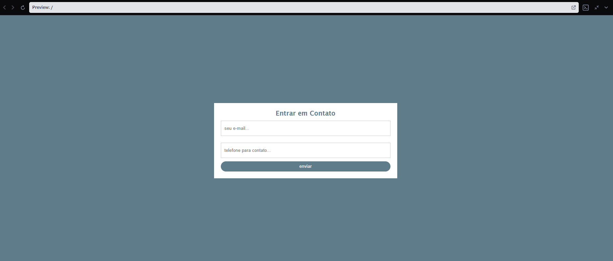

# Auto Parts Contact Form

A contact form I made as a base for an auto parts store website. It was a first sketch of what the client asked for, so we could talk about the layout and the fields before building the real site.

The form has no backend yet, so clicking "Enviar contato" does not send anything. It is only the front-end.

## About this project

I wrote the first version in 2023 (`original-2023.html`). In 2026 I came back to it, found some mistakes and fixed them (`index.html`). I kept both files so I can see what I learned.

## What the form has

- Two panels: a short message on the left and the form on the right
- Email and phone fields, both required
- Works on desktop and on mobile (the panels stack on small screens)
- Only HTML and CSS, no JavaScript and no libraries

## Tech

## How to run

Download `index.html` and open it in your browser. You don't need to install anything.

## Mistakes I found in the 2023 version

| In 2023 | Now | Why |
|---|---|---|
| Phone field was `type="password"` | `type="tel"` | The phone number showed as dots, and the browser treated it like a password |
| Email field was `type="text"` | `type="email"` | The browser checks the email format by itself |
| The form had no `action` and no `method` | `action` and `method="post"` | Without a method the data goes in the URL (GET) |
| `box-sizing: 0` | `box-sizing: border-box` | `0` is not a valid value, so the inputs were wider than the form |
| No `<!DOCTYPE>`, no `charset`, no `viewport` | Added the three | Normal page rendering, correct accents and a good mobile view |
| `<style>` outside the `<head>` | Inside the `<head>` | Valid HTML |
| Only placeholders | Added `<label>` | The text stays visible while typing, and screen readers can read the field |
| JavaScript to change the border color | CSS `:focus` | Less code for the same result |

## What is missing

- A backend to receive the data and check it on the server (the browser validation alone is not safe)
- Protection against spam, and HTTPS
- A message field and a confirmation after sending
- The real logo and colors of the store

## What I learned

- Each input needs the right `type`. A password type is only for passwords.
- A form without `method` can leak personal data in the URL.
- Validation in the browser is for the user. Validation on the server is for security.
- Email and phone are personal data, so the real site needs to follow privacy laws like LGPD.

## Author

**Nicolas Borges Ocampos**
[LinkedIn](https://www.linkedin.com/in/nicolas-borges-ocampos)
